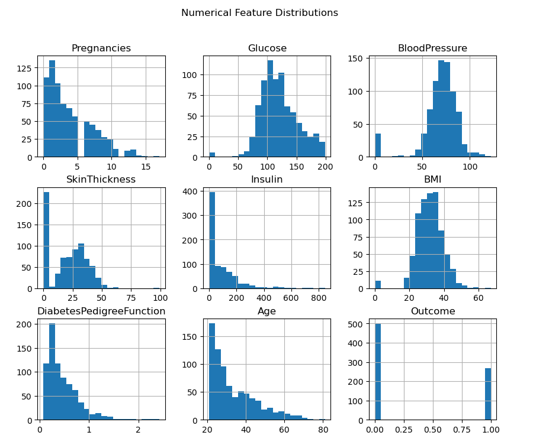
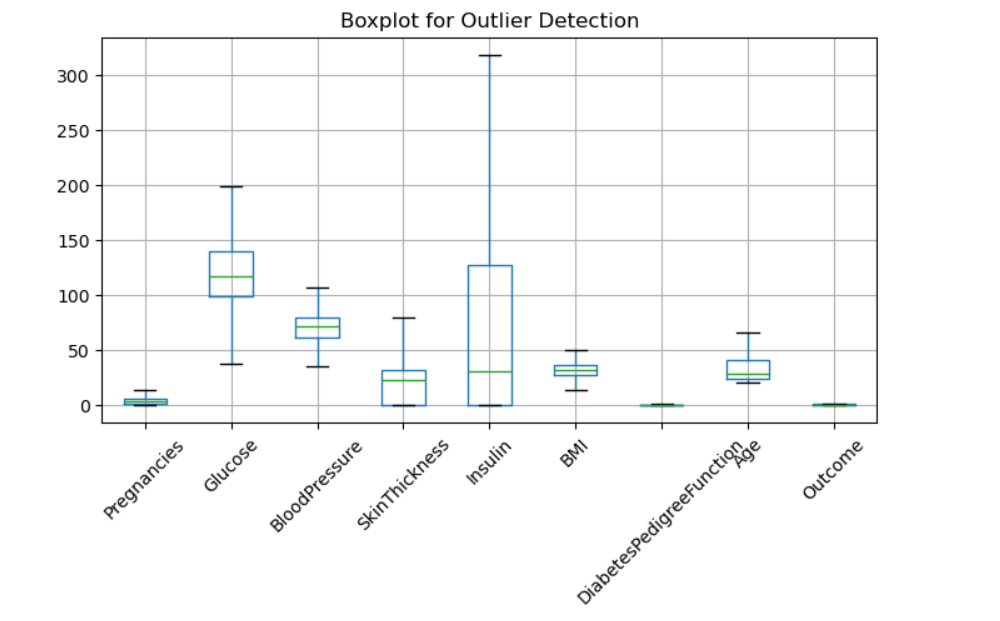
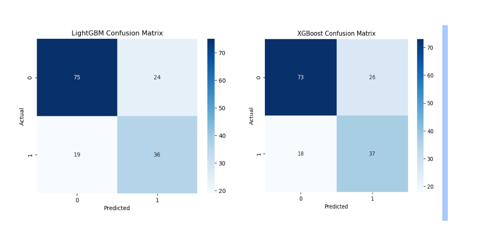
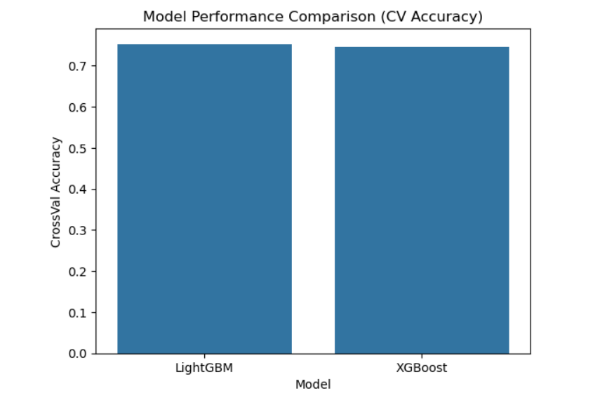
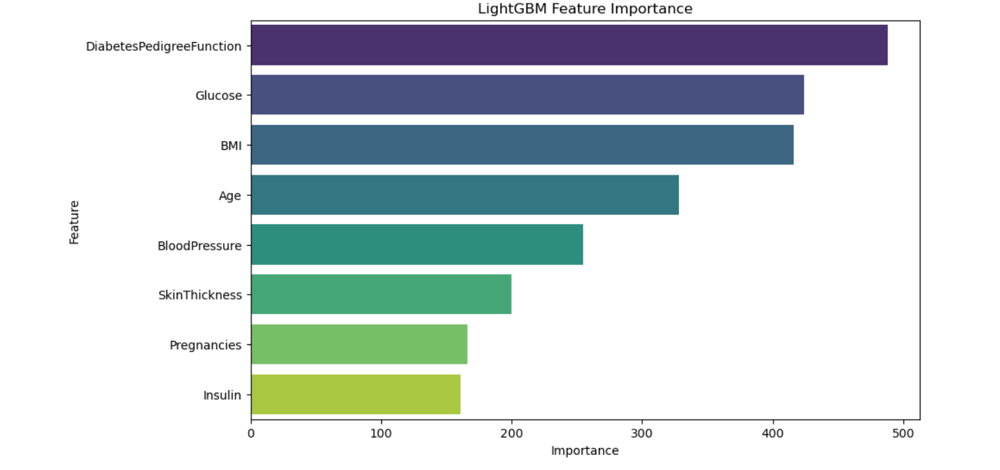

# 🚀 Diabetes Prediction using LightGBM vs XGBoost

This project focuses on predicting diabetes using machine learning models and comparing the performance of two powerful gradient boosting algorithms: **LightGBM** and **XGBoost**.

---

## 📌 Objective

The goal of this project is to:

- Build predictive models for diabetes classification
- Compare the performance of LightGBM and XGBoost
- Analyze model strengths and weaknesses
- Derive meaningful insights from healthcare data

---

## 📂 Dataset

- Dataset: `diabetes.csv`
- Contains medical attributes such as:
  - Glucose
  - Blood Pressure
  - BMI
  - Insulin
  - Age
  - Outcome (Target: Diabetes or Not)

---

## 🔍 Exploratory Data Analysis (EDA)

- Checked missing values and dataset structure
- Visualized feature distributions using histograms
- Detected outliers using boxplots and IQR method
- Explored relationships using:
  - Bar plots (Outcome vs Glucose)
  - Scatter plots (BMI vs Glucose)

---

## 🧹 Data Preprocessing

- Replaced invalid zero values with median
- Handled missing values
- Outlier detection and treatment using IQR
- No encoding required (all features numeric)

---

## ⚙️ Model Building

### 🔹 LightGBM Model
- Fast and efficient gradient boosting framework
- Handles large datasets effectively

### 🔹 XGBoost Model
- Robust boosting algorithm
- Handles complex patterns and noise well

---

## 📊 Model Evaluation Metrics

- Accuracy
- Precision
- Recall
- F1 Score
- Confusion Matrix
- Cross-Validation Accuracy

---

## 🔁 Cross Validation Results

- LightGBM CV Accuracy: *0.7526*
- XGBoost CV Accuracy: *0.7448*

---

## 📈 Model Comparison

- Both models performed well with similar accuracy
- LightGBM:
  - Faster training
  - Efficient for large datasets
- XGBoost:
  - Better handling of complex patterns
  - More robust to noise

---

## 📊 Feature Importance

Key features influencing diabetes prediction:

- Glucose
- BMI
- Age
- Diabetes Pedigree Function

---

## 📊 Visualizations

### 🔹 Feature Distribution

### 🔹 Outlier Detection

### 🔹 Confusion Matrix

### 🔹 Model Comparison

### 🔹 Feature Importance

---

## 💡 Key Learnings

- Boosting algorithms significantly improve model performance
- LightGBM is faster and scalable
- XGBoost provides better generalization in some cases
- Feature importance helps interpret model decisions

---

## 🛠️ Tech Stack

- Python
- Pandas, NumPy
- Matplotlib, Seaborn
- Scikit-learn
- LightGBM
- XGBoost

---

## 📁 Project Structure

Diabetes-Prediction-LGBM-vs-XGBoost/
│── diabetes.csv
│── diabetes_model.ipynb
│── requirements.txt
│── images/
│── README.md

---

## 👩‍💻 Author

**Meghana C Varghese**
